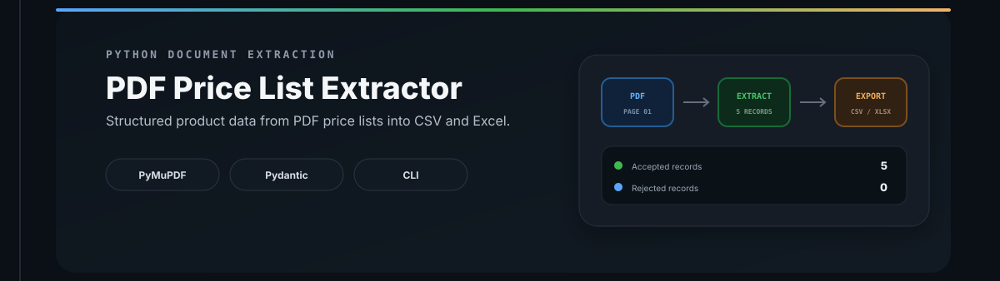
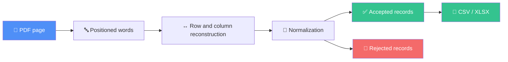

<div align="center">
  
</div>

<br>

<div align="center">

# 📄 PDF Price List Extractor

**A Python extraction pipeline that turns text-based PDF price lists into clean, validated CSV or Excel datasets.**

[](https://www.python.org/)
[](#-testing)
[](#-outputs)
[](#-purpose)

</div>

---

## 📌 Overview

This project is an end-to-end document data extraction exercise. It reads positioned words from a text-based PDF, reconstructs table rows from page coordinates, maps values into a stable product schema, validates the normalized records, and exports accepted data to **CSV or XLSX**.



---

## 📚 Table of Contents

- [Features](#-features)
- [Output Schema](#-output-schema)
- [Pipeline Architecture](#-pipeline-architecture)
- [Installation](#-installation)
- [Usage](#-usage)
- [CLI Options](#-cli-options)
- [Column Boundaries](#-column-boundaries)
- [Outputs](#-outputs)
- [Example Run](#-example-run)
- [Testing](#-testing)
- [Reliability](#-reliability)
- [Project Structure](#-project-structure)
- [Current Limitations](#-current-limitations)
- [Possible Extensions](#-possible-extensions)
- [Purpose](#-purpose)

---

## ✨ Features

| Feature | Description |
|---|---|
| **Coordinate-based extraction** | Reads positioned PDF words with PyMuPDF |
| **Row reconstruction** | Groups words by vertical position with a configurable tolerance |
| **Layout-aware column splitting** | Maps words into columns using supplied X-coordinate boundaries |
| **Header detection** | Starts extraction after the expected six-column table header |
| **Record normalization** | Cleans whitespace and converts price text into currency and numeric amount |
| **Acceptance / rejection flow** | Separates valid records from incomplete ones |
| **CSV and Excel export** | Writes accepted records to `.csv` or `.xlsx` |
| **Automatic output directories** | Creates missing parent directories before export |
| **CLI error handling** | Clear errors and non-zero exit codes for common failures |
| **35-test automated suite** | Core extraction stages and CLI behavior are covered |

---

## 🧬 Output Schema

Each accepted row is converted into the same eight-field structure:

| Field | Type | Description |
|---|---|---|
| `sku` | `str` | Product identifier |
| `product` | `str` | Product name |
| `dimensions` | `str` | Original dimensions text |
| `weight` | `str` | Original weight text |
| `power` | `str` | Original power text |
| `price_raw` | `str` | Original price representation |
| `currency` | `str` | Currency parsed from `price_raw` |
| `price` | `float` | Numeric price value |

---

## 🏗️ Pipeline Architecture

<details>
<summary><strong>1️⃣ PDF reader</strong> — click to expand</summary>

PyMuPDF opens the document, validates the requested zero-based page index, and returns page words together with their coordinates.
</details>

<details>
<summary><strong>2️⃣ Row reconstruction</strong></summary>

Words are sorted by vertical position and grouped into rows. A default Y-axis tolerance of `3` absorbs small alignment differences inside the same visual row.
</details>

<details>
<summary><strong>3️⃣ Column mapping</strong></summary>

Each word is assigned to a column from its X coordinate. Five boundaries create the expected six-column layout:

```text
SKU | PRODUCT | DIMENSIONS | WEIGHT | POWER | PRICE
```
</details>

<details>
<summary><strong>4️⃣ Header and record extraction</strong></summary>

The extractor ignores page content until it finds the expected table header. Rows after the header are retained when both the SKU and price columns contain data.
</details>

<details>
<summary><strong>5️⃣ Normalization and validation</strong></summary>

- Repeated and surrounding whitespace is removed
- Row values are mapped to named fields
- Currency and numeric amount are separated
- SKU, product name, and raw price are required
- Records are split into accepted and rejected collections
</details>

<details>
<summary><strong>6️⃣ Export</strong></summary>

Accepted records are written in a stable field order. The output extension selects the writer:

- `.csv` → Python `csv`
- `.xlsx` → `openpyxl`
</details>

---

## ⚙️ Installation

```powershell
git clone https://github.com/Mr-sanabi/pdf-price-list-extractor.git
cd pdf-price-list-extractor

python -m venv .venv
.\.venv\Scripts\Activate.ps1

pip install -e .
```

On Linux or macOS, activate the environment with:

```bash
source .venv/bin/activate
```

**Runtime dependencies:** `PyMuPDF`, `pydantic`, `openpyxl`

---

## 🚀 Usage

```powershell
python -m pdf_price_extractor.cli --help
```

### Export the included sample to CSV

```powershell
python -m pdf_price_extractor.cli `
  tests/fixtures/sample.pdf `
  data/output/products.csv `
  --page 0 `
  --columns 170 350 470 550 630
```

### Export the included sample to Excel

```powershell
python -m pdf_price_extractor.cli `
  tests/fixtures/sample.pdf `
  data/output/products.xlsx `
  --page 0 `
  --columns 170 350 470 550 630
```

### Linux / macOS syntax

```bash
python -m pdf_price_extractor.cli \
  tests/fixtures/sample.pdf \
  data/output/products.csv \
  --page 0 \
  --columns 170 350 470 550 630
```

---

## 🎛️ CLI Options

| Argument | Required | Default | Description |
|---|---:|---:|---|
| `pdf_path` | Yes | — | Path to the source PDF |
| `output_path` | Yes | — | Destination ending in `.csv` or `.xlsx` |
| `--page` | No | `0` | Zero-based page number to process |
| `--columns` | Yes | — | Ordered X-coordinate boundaries for the source layout |

> Invalid output formats, missing files, and nonexistent pages return exit code `1` with a readable error on `stderr`.

---

## 📐 Column Boundaries

`--columns` defines where one table field ends and the next begins. Five X coordinates divide each row into six columns:

```text
          170       350          470      550     630
SKU        | PRODUCT | DIMENSIONS | WEIGHT | POWER | PRICE
```

These values are **layout-specific PDF coordinates**, not universal widths. The sample values are tuned for [`tests/fixtures/sample.pdf`](tests/fixtures/sample.pdf). A different supplier price list may require different boundaries.

---

## 📤 Outputs

### 📄 CSV

UTF-8 CSV with a header and normalized accepted records.

```text
sku,product,dimensions,weight,power,price_raw,currency,price
```

### 📊 Excel

An `.xlsx` workbook with the same stable column order as the CSV output.

> Output directories are created automatically. Rejected records are counted and returned by the pipeline, but are not written to a separate file in the current version.

---

## 🧪 Example Run

**Input:** bundled sample PDF, page `0`

```text
Exported: 5
Rejected: 0
```

Successful execution returns exit code `0`.

Common failure examples:

```text
Error: PDF file not found: missing.pdf
Error: Unsupported output format: .txt
Error: Page 99 does not exist
```

---

## ✅ Testing

Install the development dependencies and run the complete suite:

```powershell
pip install -e ".[dev]"
python -m pytest -v
```

```text
35 passed ✔
```

The suite covers PDF reading, row grouping, column splitting, table extraction, normalization, validation, CSV/XLSX writers, the full pipeline, CLI parsing, and CLI error handling.

Run a single module:

```powershell
python -m pytest tests/test_pipeline.py -v
```

---

## 🛡️ Reliability

Missing-file checks · page-range validation · deterministic row ordering · explicit accepted/rejected paths · stable export fields · automatic output-directory creation · unsupported-format validation · `stderr` error reporting · meaningful process exit codes.

---

## 🗂️ Project Structure

```text
pdf-price-list-extractor/
├── assets/
│   └── readme/
│       └── banner.svg
├── src/
│   └── pdf_price_extractor/
│       ├── cli.py
│       ├── exporter.py
│       ├── normalizer.py
│       ├── pdf_reader.py
│       ├── pipeline.py
│       └── table_extractor.py
├── tests/
│   ├── fixtures/
│   │   └── sample.pdf
│   ├── test_cli.py
│   ├── test_exporter.py
│   ├── test_normalizer.py
│   ├── test_pdf_reader.py
│   ├── test_pipeline.py
│   └── test_table_extractor.py
├── .gitignore
├── pyproject.toml
└── README.md
```

---

## 🚧 Current Limitations

- Only text-based PDFs are supported; scanned documents require OCR
- One page is processed per CLI command
- The table must use the expected six-column header and field order
- Column boundaries must be configured for each distinct page layout
- Price parsing expects a currency token followed by a numeric amount
- Rejected records are counted but not exported separately
- CLI-based only — no API, UI, database, or batch directory processing

## 🗺️ Possible Extensions

- [ ] Automatic column-boundary detection
- [ ] OCR fallback for scanned price lists
- [ ] Multi-page and whole-document extraction
- [ ] Configurable headers and output schemas
- [ ] Separate rejected-record report with error reasons
- [ ] Locale-aware price and decimal parsing
- [ ] Batch processing for PDF directories
- [ ] JSON export
- [ ] CI test execution with GitHub Actions

---

## 🎯 Purpose

Built as a **portfolio-grade document data extraction project** focused on transforming semi-structured PDF tables into reusable datasets — covering coordinate-based parsing, layout reconstruction, normalization, validation, CLI orchestration, multi-format export, automated testing, and predictable failure handling.

---

<div align="center">

Made with 🐍 Python · powered by PyMuPDF · tested with 🧪 pytest

</div>
